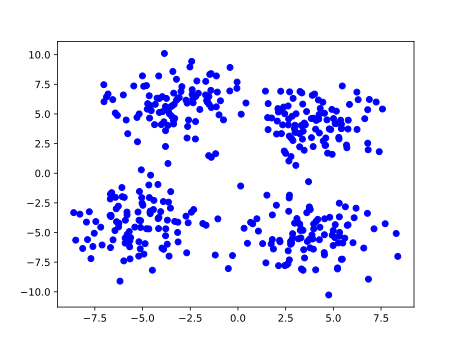
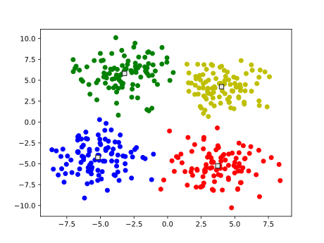

# k-meansクラスタリング
## コードの説明
#### testdata.py
2次元の座標平面上の4点から正規乱数を用いて各点に対して100個ずつ，計400個の点を生成し，その座標を"../data/test.txt"に保存する．
#### main.cpp, kMeans.cpp/hpp
"../data/test.txt"からデータを読み取り，k-meansクラスタリングを行う．
また，その結果は"../data/result.csv"に保存される．
保存内容は要素が4つのものは各点の"クラスID，座標1，座標2，クラスタ重心までの距離"，要素が2つのものはクラスタ重心の"座標1，座標2"である．
#### result.py
"../data/result.csv"を読み取り，クラスを色分けしてプロットする．また，クラスタ重心は□でプロットされる．

## 実行結果
####testdata.pyを実行

####k-meansクラスタリング後，result.pyを実行

